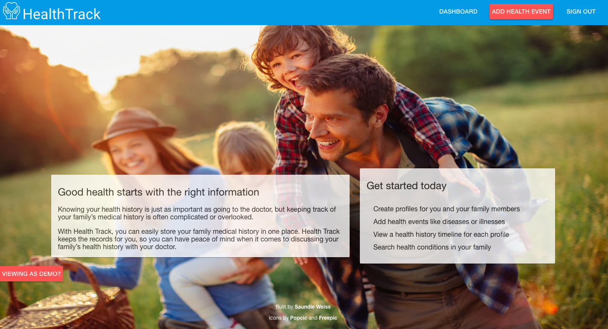
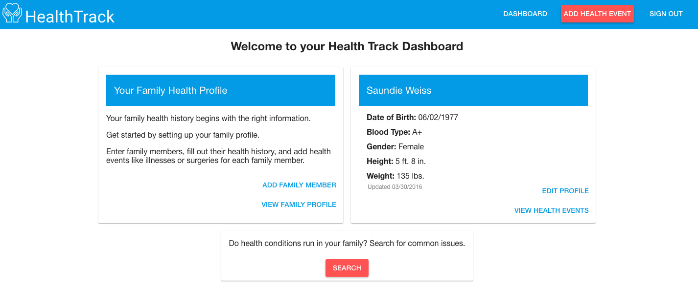
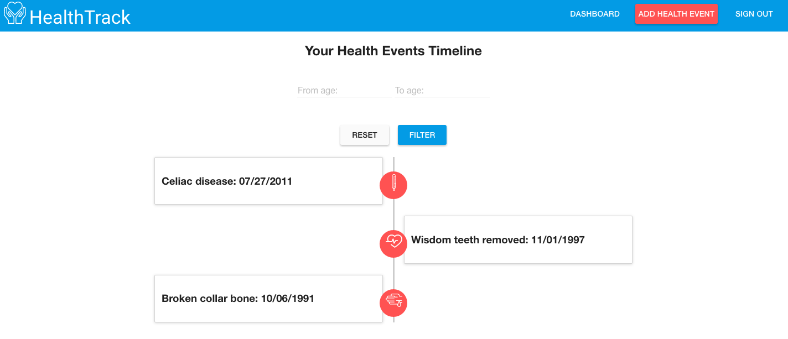
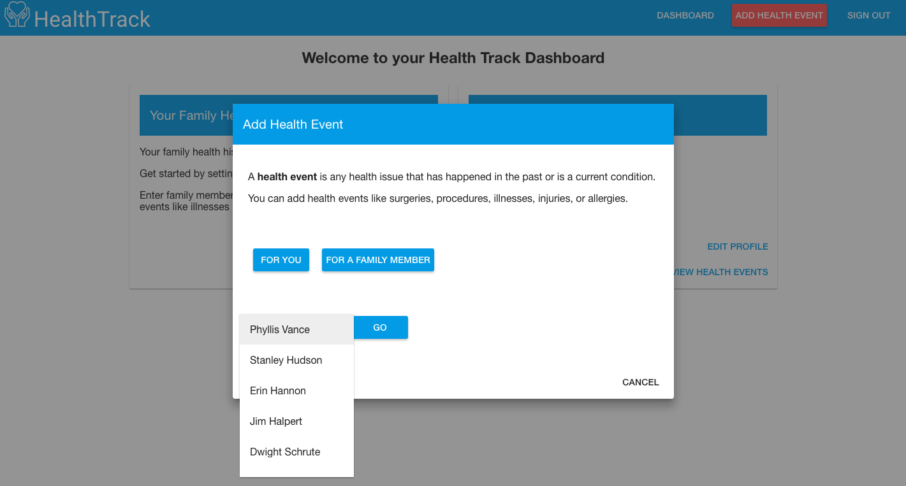
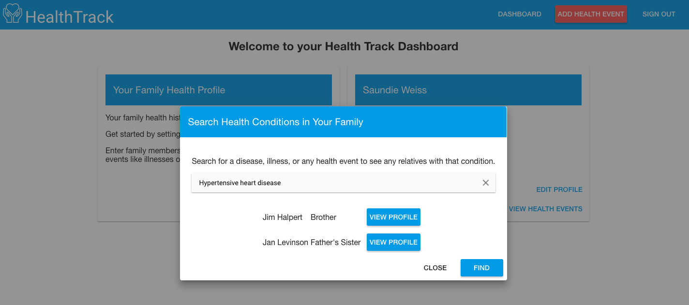

# HealthTrack
## A family medical history tracker

View live at https://healthtrack.online

Backend repo: https://github.com/saundie184/health-track-backend

## About
HealthTrack helps you track your family's medical history so you have a full perspective on the health conditions that run in your family. You can set up profiles that include information about blood type, height, weight, and date of birth/date of death. Additionally, users set up health events that include surgeries, procedures, illnesses, injuries, and allergies.

## Features
- Create health history profiles for yourself and your family members
- Add health events like illnesses or conditions
- View a timeline of health events for yourself and for each family member
- Search for common health conditions among family members

##Tech Notes
- HTML, CSS, JavaScript
- NodeJS/ExpressJS
- AngularJS
- Angular Material Design

